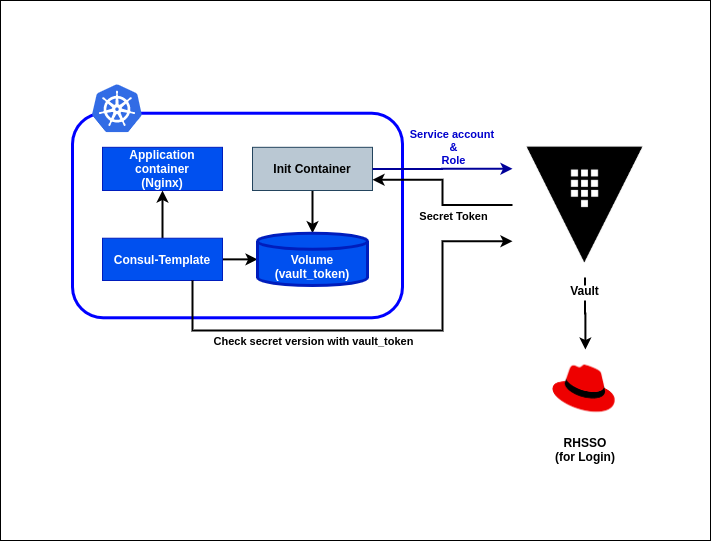
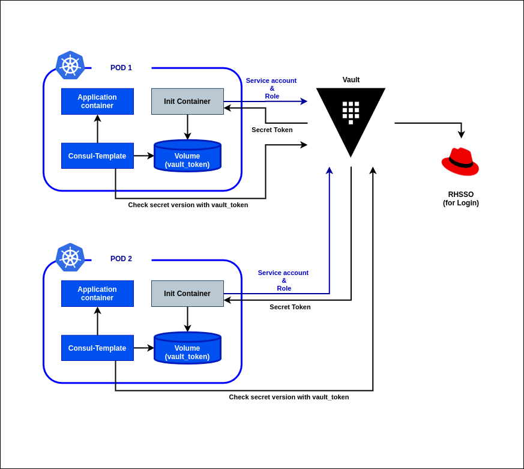

# Start Hashicorp Vault server and connect Kube PODS

## Introduction

In this example we will connect a Vault Application with a POD and reload the configs when we change them in Vault.



The objectif is to show that we can push a new config to multiple containers whitout having to do it manually and to know wich ones need it.



## Installing Hashicorp Vault

https://www.vaultproject.io/docs/install/

## Start Hashicorp Vault in DEV mode

```
vault server -dev -dev-listen-address="192.168.42.1:8200" -dev-root-token-id="test"
```

- dev-listen-address : address where tour vault will be listening for calls. Must be an IP that the kube pods can access.
- dev-root-token-id="test" : used to assign a default root token. If this parameter is not set vault will automatically generate a new token on every start.

Set the environment variable VAULT_ADDR. When vault is lauched it specifies what is the value to be set and what are the the root token and unseal key used : 

```
You may need to set the following environment variable:

    $ export VAULT_ADDR='http://192.168.42.1:8200'

The unseal key and root token are displayed below in case you want to
seal/unseal the Vault or re-authenticate.

Unseal Key: yAMdayBv0Eli6zfeLyRn3GNFm9f45/Bk8W0YHdn/cjw=
Root Token: test
```


## Start Hashicorp Vault in PROD mode

In prodution mode you have to pass a config file to the vault command.

```
vault server -config=/etc/vault/config.hcl
```

For more information : https://www.vaultproject.io/docs/commands/server/

## Hashicorp Vault UI

IHM of the Hashicorp Vault application.

Can be accessed using the VAULT_ADDR : ${VAULT_ADDR}/ui/vault/access/kubernetes/configuration

## OIDC for login

You can use an SSO application for the login by activating the OIDC authentication method

Execute the `oidc/oidc-k8s-setup.sh` file or do it step by step

### Enable oidc auth method

This will activate the OIDC authentication method that we will use further for login

```
vault auth enable oidc
```

### Configure the oidc auth method

We will create the configuration for the OIDC authentication. Here we will specify the access that we have configured inside our SSO application.

```
vault write auth/oidc/config \
        oidc_discovery_url="${OIDC_URL}" \
        oidc_client_id="${OIDC_CLIENT_ID}" \
        oidc_client_secret="${OIDC_CLIENT_SECRET}" \
        default_role="reader"
```

### Create the reader Default Role

We will create a default role to use for the OIDC authentication

```
vault write auth/oidc/role/reader \
        bound_audiences="vault" \
        allowed_redirect_uris="http://192.168.42.1:8200/ui/vault/auth/oidc/oidc/callback" \
        allowed_redirect_uris="http://192.168.42.1:8200/oidc/callback" \
        user_claim="sub" \
        policies="reader"
```


## Hashicorp Vault Agent with Kube

You can execute the `vault-k8s-setup.sh` file or do it step by step.

### Check vault 

To check if vault is properly configured and up run the following command : `vault status`

You must get a result of the type : 
```
Key             Value
---             -----
Seal Type       shamir
Initialized     true
Sealed          false
Total Shares    1
Threshold       1
Version         1.3.2
Cluster Name    vault-cluster-9476b62e
Cluster ID      3b33edd5-f5e6-317c-ea44-4cacdb7fa688
HA Enabled      false
```

### Create a service account, 'vault-auth'
```
kubectl create serviceaccount vault-auth
```

### Update the 'vault-auth' service account
```
kubectl apply --filename vault-auth-service-account.yml
```

### Policies

The policy file `kisio-kv-ro.hcl` will be used to specify the policies available for the application.

```
vault policy write kisio-kv-ro kisio-kv-ro.hcl
```

### Create test data in the `secret/kisio` path.

```
vault kv put secret/kisio/config username='martin' password='martin_pass' ttl='10s'
```

### Enable configs 

K/V v1 at secret/ if it's not already available
```
vault secrets list
vault secrets enable -path=secret kv
```

Kubernetes auth method at the default path ("auth/kubernetes") if it's not already available
```
vault auth list
vault auth enable kubernetes
```

### Create ConfigMap

Create the configmap that will be used by the pods
```
kubectl create configmap kisio-vault-agent-config --from-file=./configs-k8s/
```

To test if the configmap is correctly created :
```
kubectl get configmap kisio-vault-agent-config -o yaml
```

### Get Auth tokens

Set VAULT_SA_NAME to the service account you created earlier

```
export VAULT_SA_NAME=$(kubectl get sa vault-auth -o jsonpath="{.secrets[*]['name']}")
```

Set SA_JWT_TOKEN value to the service account JWT used to access the TokenReview API

```
export SA_JWT_TOKEN=$(kubectl get secret $VAULT_SA_NAME -o jsonpath="{.data.token}" | base64 --decode; echo)
```

Set SA_CA_CRT to the PEM encoded CA cert used to talk to Kubernetes API

```
export SA_CA_CRT=$(kubectl get secret $VAULT_SA_NAME -o jsonpath="{.data['ca\.crt']}" | base64 --decode; echo)
```

### Tell Vault how to communicate with the Kubernetes (Minikube) cluster

```
export K8S_HOST=10.152.183.1 # Microk8s IP
export K8S_PORT=443 # Microk8s port
vault write auth/kubernetes/config token_reviewer_jwt="$SA_JWT_TOKEN" kubernetes_host="https://$K8S_HOST:$K8S_PORT" kubernetes_ca_cert="$SA_CA_CRT"
```

### Create a role named, 'kisio' to map Kubernetes Service Account to Vault policies and default token TTL
```
vault write auth/kubernetes/role/kisio bound_service_account_names=vault-auth bound_service_account_namespaces=default policies=kisio-kv-ro ttl=24h
```

## Start PODS

```
kubectl apply -f kisio-k8s-spec.yml --record
```

## Usefull documentations

- Hashicorp vault agent with Kubernetes : https://learn.hashicorp.com/vault/identity-access-management/vault-agent-k8s and https://github.com/hashicorp/vault-guides/tree/master/identity/vault-agent-k8s-demo
- Hashicorp vault beginners guide : https://devopscube.com/setup-hashicorp-vault-beginners-guide/
- Hashicorp vault with DATABASE : https://learn.hashicorp.com/vault/developer/sm-app-integration
